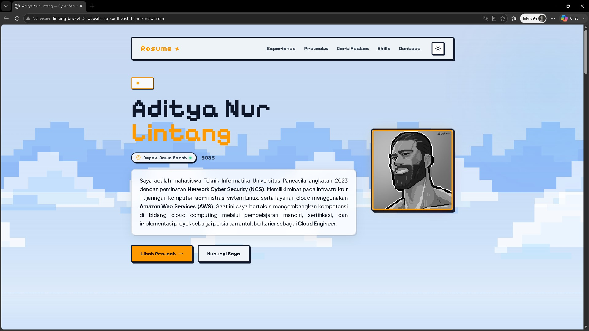
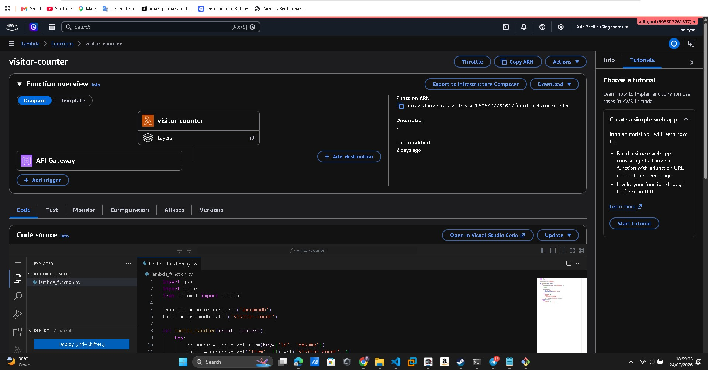
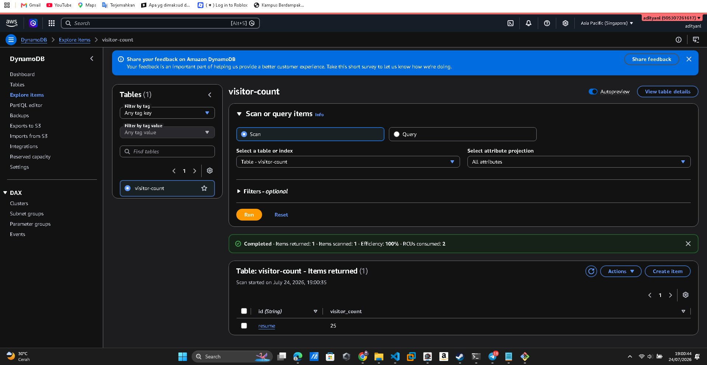
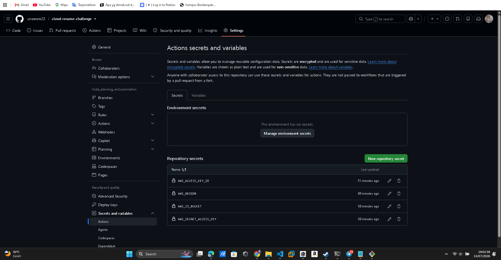
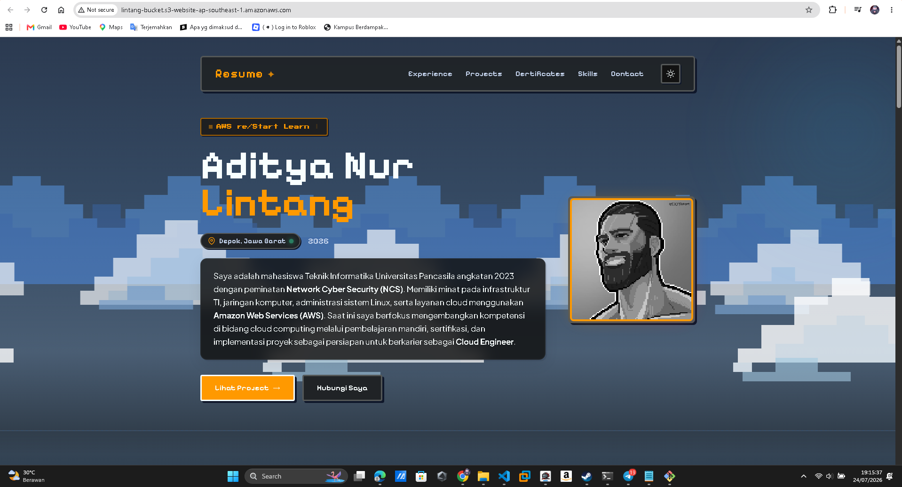
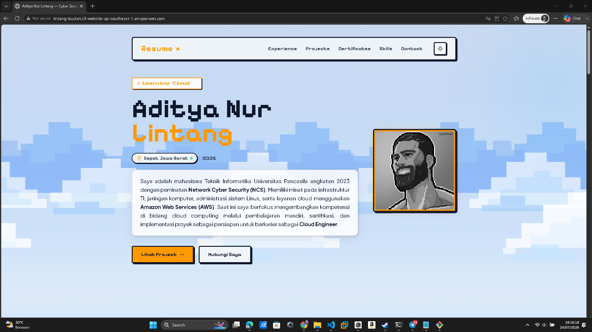
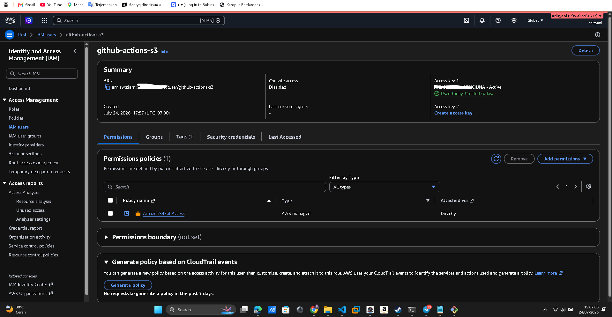

# Cloud Resume Challenge — Aditya Nur Lintang

A cloud-native resume website built on AWS, implementing serverless architecture, Infrastructure as Code concepts, and CI/CD automation. This project demonstrates real-world cloud engineering skills for a production-grade portfolio.

**Live URL:** http://lintang-bucket.s3-website-ap-southeast-1.amazonaws.com

---

## Architecture Overview

```
                        ┌─────────────────────────────────────────┐
                        │              AWS Cloud                  │
                        │                                         │
  User ──── HTTP ──────▶│  S3 Static Website                      │
                        │  (index.html, styles.css, script.js)    │
                        │          │                              │
                        │          │ fetch()                      │
                        │          ▼                              │
                        │  API Gateway (REST)                     │
                        │  /prod/visitor [GET]                    │
                        │          │                              │
                        │          ▼                              │
                        │  Lambda Function                        │
                        │  (Python 3.x)                           │
                        │          │                              │
                        │          ▼                              │
                        │  DynamoDB Table                         │
                        │  visitor-count                          │
                        └─────────────────────────────────────────┘

  GitHub ── git push ──▶ GitHub Actions ── aws s3 sync ──▶ S3 Bucket
```

---

## Tech Stack

| Layer    | Service             | Purpose                          |
| :------- | :------------------ | :------------------------------- |
| Frontend | Amazon S3           | Static website hosting           |
| CDN      | Amazon CloudFront   | HTTPS, global CDN _(pending)_    |
| Backend  | AWS Lambda (Python) | Serverless visitor counter logic |
| Database | Amazon DynamoDB     | Visitor count storage (NoSQL)    |
| API      | Amazon API Gateway  | REST endpoint trigger for Lambda |
| CI/CD    | GitHub Actions      | Auto-deploy on git push          |
| IAM      | AWS IAM             | Least-privilege access control   |

---

## Project Structure

```
cloud-resume-challenge/
├── index.html                    # Resume website (main page)
├── styles.css                    # Styling and responsive design
├── script.js                     # Visitor counter fetch logic
├── CV.pdf                        # Downloadable CV
├── hero.png                      # Profile photo
├── Certificate/                  # Certification documents
│   ├── images/                   # Certificate preview images
│   └── *.pdf                     # Certificate PDF files
└── .github/
    └── workflows/
        └── deploy.yml            # CI/CD pipeline definition
```

---

## Features

- **Static Resume Website** — Hosted on Amazon S3 with public read access
- **Live Visitor Counter** — Serverless counter using Lambda + DynamoDB + API Gateway
- **CI/CD Pipeline** — Every `git push` to `main` triggers auto-deploy to S3
- **Dark / Light Theme** — Toggle between dark and light mode
- **Downloadable CV** — Direct PDF download from S3
- **Certificate Gallery** — All certifications viewable and downloadable

---

## Implementation Details

### 1. Static Website Hosting (S3)

S3 bucket `lintang-bucket` configured with Static Website Hosting enabled.

Bucket Policy (public read):

```json
{
  "Version": "2012-10-17",
  "Statement": [
    {
      "Sid": "PublicReadGetObject",
      "Effect": "Allow",
      "Principal": "*",
      "Action": "s3:GetObject",
      "Resource": "arn:aws:s3:::lintang-bucket/*"
    }
  ]
}
```

> **Screenshot:** S3 bucket with static website hosting enabled
> 

---

### 2. Visitor Counter (Lambda + DynamoDB + API Gateway)

**DynamoDB Table:**

| Attribute       | Type        | Value          |
| :-------------- | :---------- | :------------- |
| `id`            | String (PK) | `"resume"`     |
| `visitor_count` | Number      | auto-increment |

**Lambda Function (Python):**

```python
import json
import boto3

dynamodb = boto3.resource('dynamodb')
table = dynamodb.Table('visitor-count')

def lambda_handler(event, context):
    response = table.get_item(Key={'id': 'resume'})
    count = response.get('Item', {}).get('visitor_count', 0)

    new_count = int(count) + 1

    table.update_item(
        Key={'id': 'resume'},
        UpdateExpression='SET visitor_count = :c',
        ExpressionAttributeValues={':c': new_count}
    )

    return {
        'statusCode': 200,
        'headers': {'Access-Control-Allow-Origin': '*'},
        'body': json.dumps({'visitor_count': new_count})
    }
```

**API Gateway Endpoint:**

```
GET https://npcoyuaddi.execute-api.ap-southeast-1.amazonaws.com/prod/visitor
```

Response:

```json
{ "visitor_count": 42 }
```

> **Screenshot:** Lambda function — code editor and Active status
> 

> **Screenshot:** DynamoDB table `visitor-count` — item `id: resume` with visitor_count value
> 

---

### 3. CI/CD Pipeline (GitHub Actions)

Every push to `main` branch triggers automatic deployment to S3.

**.github/workflows/deploy.yml:**

```yaml
name: Deploy to AWS S3

on:
  push:
    branches:
      - main

jobs:
  deploy:
    runs-on: ubuntu-latest
    steps:
      - name: Checkout repository
        uses: actions/checkout@v4

      - name: Configure AWS credentials
        uses: aws-actions/configure-aws-credentials@v4
        with:
          aws-access-key-id: ${{ secrets.AWS_ACCESS_KEY_ID }}
          aws-secret-access-key: ${{ secrets.AWS_SECRET_ACCESS_KEY }}
          aws-region: ${{ secrets.AWS_REGION }}

      - name: Sync files to S3
        run: |
          aws s3 sync . s3://${{ secrets.AWS_S3_BUCKET }}/ \
            --exclude ".git/*" \
            --exclude ".github/*" \
            --exclude "README.md" \
            --delete

      - name: Deploy Complete
        run: echo "Deploy successful"
```

GitHub Secrets configured:

| Secret                  | Description                          |
| :---------------------- | :----------------------------------- |
| `AWS_ACCESS_KEY_ID`     | IAM user `github-actions` access key |
| `AWS_SECRET_ACCESS_KEY` | IAM user `github-actions` secret key |
| `AWS_S3_BUCKET`         | Target S3 bucket name                |
| `AWS_REGION`            | AWS region (ap-southeast-1)          |

> **Screenshot:** GitHub Actions workflow — successful run
> 

**Before & After — CI/CD in Action:**

|                 Before Push                 |                                After Push                                |
| :-----------------------------------------: | :----------------------------------------------------------------------: |
|            Website tampilan lama            |                   Website tampilan baru (auto-updated)                   |
|  |                                 |
|    _Tampilan website sebelum `git push`_    | _Tampilan website setelah `git push` — GitHub Actions auto-deploy ke S3_ |

---

### 4. IAM Security (Least Privilege)

Dedicated IAM user `github-actions` created with **minimum required permissions** — only `AmazonS3FullAccess` for CI/CD deployment. No console access granted.

Lambda execution role granted only:

- `dynamodb:GetItem`
- `dynamodb:UpdateItem`

> **Screenshot:** IAM user permissions + Lambda execution role
> 

---

## Infrastructure Diagram

```
┌──────────────────────────────────────────────────────────┐
│                     AWS ap-southeast-1                   │
│                                                          │
│   ┌─────────────┐    ┌──────────────┐    ┌────────────┐  │
│   │  S3 Bucket  │    │ API Gateway  │    │   Lambda   │  │
│   │             │    │              │    │            │  │
│   │ lintang-    │    │ /prod/visitor│───▶│ visitor-   │  │
│   │ bucket      │    │   [GET]      │    │ counter    │  │
│   │             │    └──────────────┘    └─────┬──────┘  │
│   │ index.html  │                              │         │
│   │ styles.css  │                              ▼         │
│   │ script.js   │                       ┌────────────┐   │
│   └─────────────┘                       │  DynamoDB  │   │
│          │                              │            │   │
│          │                              │ visitor-   │   │
│   Static Website                        │ count      │   │
│   Hosting                               └────────────┘   │
└──────────────────────────────────────────────────────────┘

GitHub Repository
      │
      │ git push (main)
      ▼
GitHub Actions
      │
      │ aws s3 sync
      ▼
S3 Bucket (auto-updated)
```

---

## Cost Analysis

| Service        | Free Tier Limit       | Usage   | Cost            |
| :------------- | :-------------------- | :------ | :-------------- |
| S3 Storage     | 5 GB                  | ~18 MB  | **$0.00**       |
| S3 Requests    | 20,000 GET/mo         | minimal | **$0.00**       |
| Lambda         | 1M requests/mo        | minimal | **$0.00**       |
| DynamoDB       | 25 GB storage         | < 1 KB  | **$0.00**       |
| API Gateway    | 1M calls/mo           | minimal | **$0.00**       |
| GitHub Actions | 2,000 min/mo (public) | minimal | **$0.00**       |
| **Total**      |                       |         | **$0.00/month** |

---

## What I Learned

- Hosting static websites on **Amazon S3** with public bucket policies
- Building **serverless backend** with AWS Lambda (Python) and DynamoDB
- Exposing Lambda via **API Gateway** REST endpoint with CORS enabled
- Implementing **CI/CD pipeline** using GitHub Actions and AWS CLI
- Applying **IAM least-privilege** principles for secure deployments
- Understanding **multi-tier VPC architecture** (separate project — see below)

---

## Related Projects

### Multi-Tier AWS VPC Architecture

Separate project demonstrating production-grade network architecture:

- Custom VPC (`10.0.0.0/16`) with public and private subnets
- EC2 web server (Nginx) in public subnet (`10.0.1.0/24`)
- MariaDB database in private subnet (`10.0.2.0/24`)
- Security Group restricting port 3306 to web subnet only
- phpMyAdmin accessible via `/phpmyadmin` subdirectory
- NAT Gateway for private subnet internet access

> The database is **not reachable from the internet** — only accessible through the web server via internal VPC routing (`10.0.2.188`).

---

## Pending Improvements

- [ ] CloudFront distribution for HTTPS support
- [ ] Custom domain (`lintang.my.id` or similar)
- [ ] AWS Certificate Manager (ACM) for SSL
- [ ] CloudFront cache invalidation step in CI/CD pipeline
- [ ] Terraform for Infrastructure as Code
- [ ] Unit tests for Lambda function

---

## Author

**Aditya Nur Lintang**
Network & Cyber Security — Universitas Pancasila

| Contact  | Link                                             |
| :------- | :----------------------------------------------- |
| GitHub   | www.github.com/unaware22                         |
| LinkedIn | www.linkedin.com/in/aditya-nur-lintang-b8483333a |
| Email    | adityanurlintang211@gmail.com                    |
| Location | Depok, Jawa Barat, Indonesia                     |

---

## References

- [The Cloud Resume Challenge](https://cloudresumechallenge.dev/) — Forrest Brazeal
- [AWS S3 Static Website Hosting](https://docs.aws.amazon.com/AmazonS3/latest/userguide/WebsiteHosting.html)
- [AWS Lambda Developer Guide](https://docs.aws.amazon.com/lambda/latest/dg/welcome.html)
- [GitHub Actions for AWS](https://github.com/aws-actions/configure-aws-credentials)
